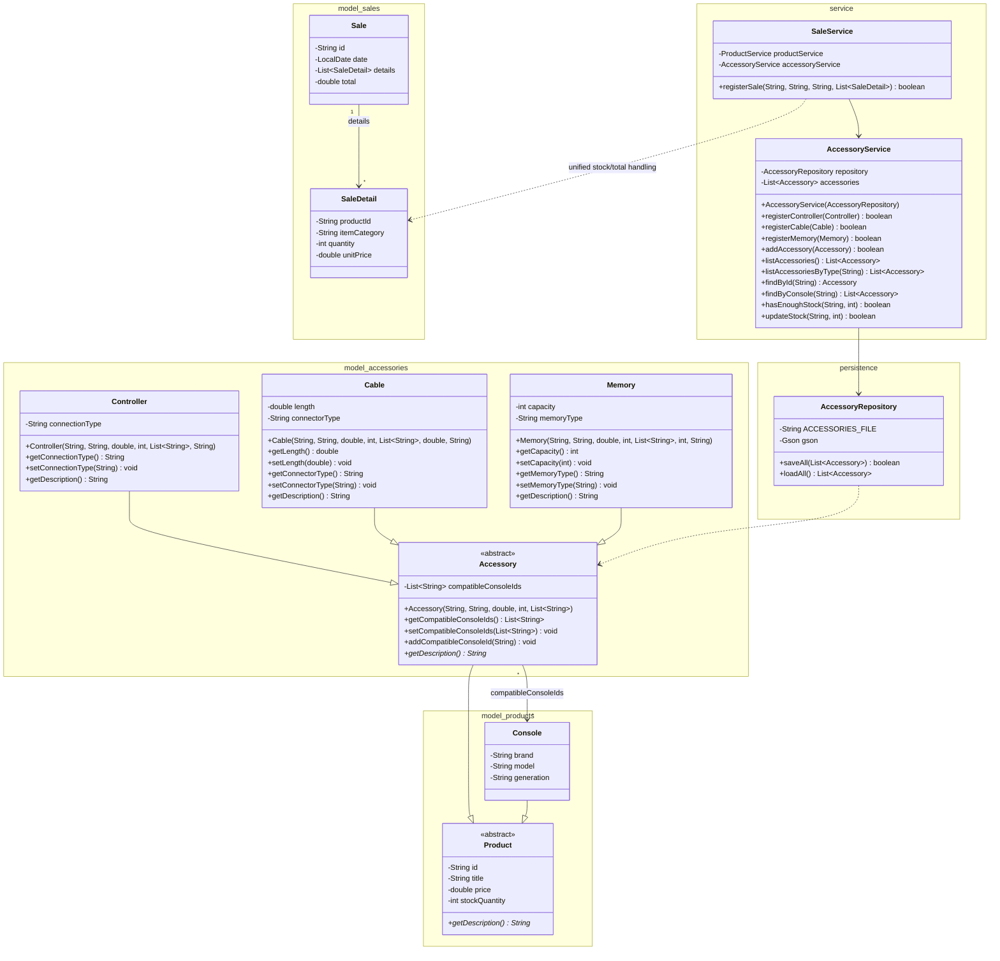

# Accessory Module - Class Diagram

```mermaid
classDiagram
    namespace model_accessories {
        class Accessory {
            <<abstract>>
            -List~String~ compatibleConsoleIds
            +Accessory(String, String, double, int, List~String~)
            +getCompatibleConsoleIds() List~String~
            +setCompatibleConsoleIds(List~String~) void
            +addCompatibleConsoleId(String) void
            +getDescription() String*
        }
        class Controller {
            -String connectionType
            +Controller(String, String, double, int, List~String~, String)
            +getConnectionType() String
            +setConnectionType(String) void
            +getDescription() String
        }
        class Cable {
            -double length
            -String connectorType
            +Cable(String, String, double, int, List~String~, double, String)
            +getLength() double
            +setLength(double) void
            +getConnectorType() String
            +setConnectorType(String) void
            +getDescription() String
        }
        class Memory {
            -int capacity
            -String memoryType
            +Memory(String, String, double, int, List~String~, int, String)
            +getCapacity() int
            +setCapacity(int) void
            +getMemoryType() String
            +setMemoryType(String) void
            +getDescription() String
        }
    }

    namespace model_products {
        class Product {
            <<abstract>>
            -String id
            -String title
            -double price
            -int stockQuantity
            +getDescription() String*
        }
        class Console {
            -String brand
            -String model
            -String generation
        }
    }

    namespace model_sales {
        class Sale {
            -String id
            -LocalDate date
            -List~SaleDetail~ details
            -double total
        }
        class SaleDetail {
            -String productId
            -String itemCategory
            -int quantity
            -double unitPrice
        }
    }

    namespace persistence {
        class AccessoryRepository {
            -String ACCESSORIES_FILE
            -Gson gson
            +saveAll(List~Accessory~) boolean
            +loadAll() List~Accessory~
        }
    }

    namespace service {
        class AccessoryService {
            -AccessoryRepository repository
            -List~Accessory~ accessories
            +AccessoryService(AccessoryRepository)
            +registerController(Controller) boolean
            +registerCable(Cable) boolean
            +registerMemory(Memory) boolean
            +addAccessory(Accessory) boolean
            +listAccessories() List~Accessory~
            +listAccessoriesByType(String) List~Accessory~
            +findById(String) Accessory
            +findByConsole(String) List~Accessory~
            +hasEnoughStock(String, int) boolean
            +updateStock(String, int) boolean
        }
        class SaleService {
            -ProductService productService
            -AccessoryService accessoryService
            +registerSale(String, String, String, List~SaleDetail~) boolean
        }
    }

    Accessory --|> Product
    Controller --|> Accessory
    Cable --|> Accessory
    Memory --|> Accessory
    Console --|> Product
    Accessory "*" --> "*" Console : compatibleConsoleIds
    Sale "1" --> "*" SaleDetail : details
    AccessoryRepository ..> Accessory
    AccessoryService --> AccessoryRepository
    SaleService --> AccessoryService
    SaleService ..> SaleDetail : unified stock/total handling
```