# GameZone - Full Project Class Diagram

Diagrama de clases completo: sistema base (Personas, Productos, Ventas) y los
cuatro módulos de extensión (Accesorios, Promociones, Devoluciones,
Garantías).

```mermaid
classDiagram
    namespace model_persons {
        class Person {
            <<abstract>>
            -String name
            -String identification
            -String phone
            +Person(String, String, String)
            +getName() String
            +getIdentification() String
            +getPhone() String
        }
        class Customer {
            -String email
            +Customer(String, String, String, String)
            +getEmail() String
        }
        class Seller {
            -String employeeCode
            -String shift
            +Seller(String, String, String, String, String)
            +getEmployeeCode() String
            +getShift() String
        }
    }

    namespace model_products {
        class Product {
            <<abstract>>
            -String id
            -String title
            -double price
            -int stockQuantity
            +Product(String, String, double, int)
            +getId() String
            +getTitle() String
            +getPrice() double
            +getStockQuantity() int
            +setStockQuantity(int) void
            +getDescription() String*
        }
        class Videogame {
            -String platform
            -String genre
            -String ageRating
            +Videogame(String, String, double, int, String, String, String)
            +getPlatform() String
            +getGenre() String
            +getAgeRating() String
            +getDescription() String
        }
        class Console {
            -String brand
            -String model
            -String generation
            +Console(String, String, double, int, String, String, String)
            +getBrand() String
            +getModel() String
            +getGeneration() String
            +getDescription() String
        }
    }

    namespace model_accessories {
        class Accessory {
            <<abstract>>
            -List~String~ compatibleConsoleIds
            +Accessory(String, String, double, int, List~String~)
            +getCompatibleConsoleIds() List~String~
            +setCompatibleConsoleIds(List~String~) void
            +addCompatibleConsoleId(String) void
            +getDescription() String*
        }
        class Controller {
            -String connectionType
            +Controller(String, String, double, int, List~String~, String)
            +getConnectionType() String
            +getDescription() String
        }
        class Cable {
            -double length
            -String connectorType
            +Cable(String, String, double, int, List~String~, double, String)
            +getLength() double
            +getConnectorType() String
            +getDescription() String
        }
        class Memory {
            -int capacity
            -String memoryType
            +Memory(String, String, double, int, List~String~, int, String)
            +getCapacity() int
            +getMemoryType() String
            +getDescription() String
        }
    }

    namespace model_sales {
        class Sale {
            -String id
            -LocalDate date
            -String customerId
            -String sellerId
            -List~SaleDetail~ details
            -double total
            -String appliedPromotionName
            -double discountAmount
            +Sale(String, LocalDate, String, String, List~SaleDetail~)
            +getSubtotal() double
            +getSaleId() String
            +getDate() LocalDate
            +getDetails() List~SaleDetail~
            +getAppliedPromotionName() String
            +setAppliedPromotionName(String) void
            +getDiscountAmount() double
            +setDiscountAmount(double) void
            +getTotal() double
            +setTotal(double) void
            +canBeReturned() boolean
            +generateReceipt() String
        }
        class SaleDetail {
            -String productId
            -String itemCategory
            -int quantity
            -double unitPrice
            +SaleDetail(String, String, int, double)
            +getSubtotal() double
            +getProductId() String
            +getItemCategory() String
            +getQuantity() int
            +getUnitPrice() double
        }
    }

    namespace model_promotions {
        class Promotion {
            <<abstract>>
            -String id
            -String name
            -LocalDate startDate
            -LocalDate endDate
            +Promotion(String, String, LocalDate, LocalDate)
            +getId() String
            +getName() String
            +getStartDate() LocalDate
            +getEndDate() LocalDate
            +isActive(LocalDate) boolean
            +calculateDiscount(Sale) double*
        }
        class PercentageDiscount {
            -double percentage
            +PercentageDiscount(String, String, LocalDate, LocalDate, double)
            +calculateDiscount(Sale) double
        }
        class CategoryDiscount {
            -double percentage
            -String targetCategory
            +CategoryDiscount(String, String, LocalDate, LocalDate, double, String)
            +calculateDiscount(Sale) double
        }
        class BulkPurchaseDiscount {
            -int minQuantity
            -double percentage
            +BulkPurchaseDiscount(String, String, LocalDate, LocalDate, int, double)
            +calculateDiscount(Sale) double
        }
    }

    namespace model_returns {
        class Return {
            -String returnId
            -LocalDate date
            -Sale originalSale
            -List~Product~ returnedProducts
            -String reason
            -double refundAmount
            +Return(String, Sale, List~Product~, String)
            +Return(String, LocalDate, Sale, List~Product~, String, double)
            +getReturnId() String
            +getOriginalSale() Sale
            +getReturnedProducts() List~Product~
            +getRefundAmount() double
            +calculateRefundAmount() double
            +generateReturnReceipt() String
        }
    }

    namespace model_warranties {
        class Warranty {
            <<abstract>>
            -String warrantyId
            -Product product
            -Sale sale
            -LocalDate startDate
            -LocalDate endDate
            +Warranty(String, Product, Sale, LocalDate)
            +getWarrantyId() String
            +getProduct() Product
            +getSale() Sale
            +getStartDate() LocalDate
            +getEndDate() LocalDate
            +getDurationInMonths() int*
            +getWarrantyType() String*
            +getAdditionalCost() double*
            +isActive(LocalDate) boolean
            +generateWarrantyCertificate() String
        }
        class BasicWarranty {
            +BasicWarranty(String, Product, Sale, LocalDate)
            +getDurationInMonths() int
            +getAdditionalCost() double
        }
        class ExtendedWarranty {
            +ExtendedWarranty(String, Product, Sale, LocalDate)
            +getDurationInMonths() int
            +getAdditionalCost() double
        }
    }

    namespace persistence {
        class PersonRepository {
        }
        class ProductRepository {
            +saveConsoles(List~Console~) boolean
            +loadConsoles() List~Console~
            +saveVideogames(List~Videogame~) boolean
            +loadVideogames() List~Videogame~
        }
        class SaleRepository {
            +loadSales() List~Sale~
            +saveSales(List~Sale~) boolean
        }
        class AccessoryRepository {
            +saveAll(List~Accessory~) boolean
            +loadAll() List~Accessory~
        }
        class PromotionRepository {
            +saveAll(List~Promotion~) boolean
            +loadAll() List~Promotion~
        }
        class ReturnRepository {
            +saveAll(List~Return~) boolean
            +loadAll() List~Return~
        }
        class WarrantyRepository {
            +saveAll(List~Warranty~) boolean
            +loadAll() List~Warranty~
        }
    }

    namespace service {
        class PersonService {
            +registerCustomer(String, String, String, String) boolean
            +listCustomers() List~Customer~
            +listSellers() List~Seller~
            +findCustomerByIdentification(String) Customer
            +findSellerByIdentification(String) Seller
        }
        class ProductService {
            +registerConsole(Console) boolean
            +registerVideogame(Videogame) boolean
            +listAllProducts() List~Product~
            +findProductById(String) Product
            +hasEnoughStock(String, int) boolean
            +reduceStock(String, int) boolean
            +restoreStock(String, int) boolean
        }
        class SaleService {
            -List~Sale~ sales
            +registerSale(String, String, String, List~SaleDetail~) boolean
            +listSales() List~Sale~
            +listSalesByCustomer(String) List~Sale~
            +listSalesBySeller(String) List~Sale~
            +findSaleById(String) Sale
        }
        class AccessoryService {
            +registerController(Controller) boolean
            +registerCable(Cable) boolean
            +registerMemory(Memory) boolean
            +listAccessories() List~Accessory~
            +listAccessoriesByType(String) List~Accessory~
            +findById(String) Accessory
            +findByConsole(String) List~Accessory~
            +hasEnoughStock(String, int) boolean
            +updateStock(String, int) boolean
        }
        class PromotionService {
            +registerPercentageDiscount(String, String, LocalDate, LocalDate, double) boolean
            +registerCategoryDiscount(String, String, LocalDate, LocalDate, double, String) boolean
            +registerBulkPurchaseDiscount(String, String, LocalDate, LocalDate, int, double) boolean
            +listAllPromotions() List~Promotion~
            +listActivePromotions() List~Promotion~
            +findBestPromotionFor(Sale) Promotion
        }
        class ReturnService {
            +registerReturn(String, List~String~, String) Return
            +viewAllReturns() List~Return~
            +viewReturnsByCustomer(String) List~Return~
            +viewReturnsBySale(String) List~Return~
            +generateMonthlyBalance(int, int) double
        }
        class WarrantyService {
            +assignBasicWarranty(Product, Sale, LocalDate) BasicWarranty
            +assignExtendedWarranty(Product, Sale, LocalDate) ExtendedWarranty
            +findWarrantyByProduct(String, String) Warranty
            +listAllWarranties() List~Warranty~
            +listActiveWarranties() List~Warranty~
            +listWarrantiesExpiringSoon(int) List~Warranty~
        }
    }

    namespace ui {
        class ConsoleUI {
            -ProductService productService
            -PersonService personService
            -SaleService saleService
            -AccessoryService accessoryService
            -ReturnService returnService
            -PromotionService promotionService
            +ConsoleUI(ProductService, PersonService, SaleService, AccessoryService, ReturnService, PromotionService)
            +start() void
        }
    }

    %% Inheritance
    Person <|-- Customer
    Person <|-- Seller
    Product <|-- Videogame
    Product <|-- Console
    Product <|-- Accessory
    Accessory <|-- Controller
    Accessory <|-- Cable
    Accessory <|-- Memory
    Promotion <|-- PercentageDiscount
    Promotion <|-- CategoryDiscount
    Promotion <|-- BulkPurchaseDiscount
    Warranty <|-- BasicWarranty
    Warranty <|-- ExtendedWarranty

    %% Model associations
    Sale "1" --> "*" SaleDetail : details
    Return "*" --> "1" Sale : originalSale
    Return "*" --> "1..*" Product : returnedProducts
    Warranty "*" --> "1" Product : product
    Warranty "*" --> "1" Sale : sale
    Promotion ..> Sale : calculateDiscount(sale)
    CategoryDiscount ..> SaleDetail : itemCategory
    Accessory "*" --> "*" Console : compatibleConsoleIds

    %% Persistence -> Model
    PersonRepository ..> Customer
    PersonRepository ..> Seller
    ProductRepository ..> Console
    ProductRepository ..> Videogame
    SaleRepository ..> Sale
    AccessoryRepository ..> Accessory
    PromotionRepository ..> Promotion
    ReturnRepository ..> Return
    WarrantyRepository ..> Warranty
    ReturnRepository --> SaleService
    ReturnRepository --> ProductService
    WarrantyRepository --> SaleService
    WarrantyRepository --> ProductService

    %% Service -> Persistence
    PersonService --> PersonRepository
    ProductService --> ProductRepository
    SaleService --> SaleRepository
    AccessoryService --> AccessoryRepository
    PromotionService --> PromotionRepository
    ReturnService --> ReturnRepository
    WarrantyService --> WarrantyRepository

    %% Service -> Service (orchestration)
    SaleService --> ProductService
    SaleService --> AccessoryService
    SaleService --> PersonService
    SaleService --> PromotionService
    ReturnService --> SaleService
    ReturnService --> ProductService

    %% UI -> Service
    ConsoleUI --> ProductService
    ConsoleUI --> PersonService
    ConsoleUI --> SaleService
    ConsoleUI --> AccessoryService
    ConsoleUI --> ReturnService
    ConsoleUI --> PromotionService
```

**Notas de fidelidad:**
- `PersonRepository` se muestra sin métodos porque su código fuente no estaba
  disponible al momento de generar este diagrama; el resto de las clases
  refleja los archivos reales del proyecto.
- `WarrantyService` y `WarrantyRepository` existen y son funcionales, pero
  **ningún otro componente los invoca todavía** — el módulo de garantías está
  implementado pero pendiente de integrar al flujo de ventas y al menú.