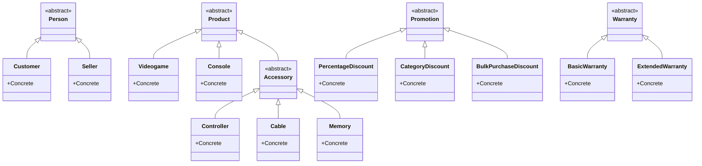

# Hierarchy Diagram

```mermaid
classDiagram
    class Person {
        <<abstract>>
    }
    class Customer {
        +Concrete
    }
    class Seller {
        +Concrete
    }

    class Product {
        <<abstract>>
    }
    class Videogame {
        +Concrete
    }
    class Console {
        +Concrete
    }
    class Accessory {
        <<abstract>>
    }
    class Controller {
        +Concrete
    }
    class Cable {
        +Concrete
    }
    class Memory {
        +Concrete
    }

    class Promotion {
        <<abstract>>
    }
    class PercentageDiscount {
        +Concrete
    }
    class CategoryDiscount {
        +Concrete
    }
    class BulkPurchaseDiscount {
        +Concrete
    }

    class Warranty {
        <<abstract>>
    }
    class BasicWarranty {
        +Concrete
    }
    class ExtendedWarranty {
        +Concrete
    }

    Person <|-- Customer
    Person <|-- Seller

    Product <|-- Videogame
    Product <|-- Console
    Product <|-- Accessory
    Accessory <|-- Controller
    Accessory <|-- Cable
    Accessory <|-- Memory

    Promotion <|-- PercentageDiscount
    Promotion <|-- CategoryDiscount
    Promotion <|-- BulkPurchaseDiscount

    Warranty <|-- BasicWarranty
    Warranty <|-- ExtendedWarranty
```

`Return` no aparece en este diagrama porque no forma parte de ninguna jerarquía de herencia — es una clase concreta independiente, sin subclases.