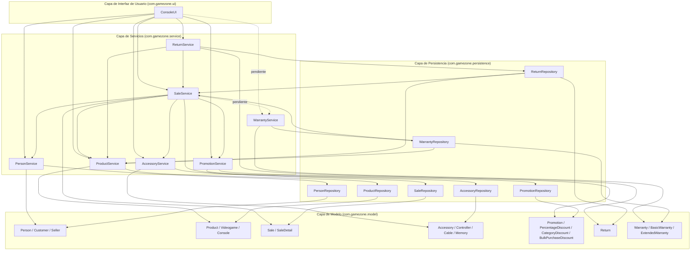

# Layer Diagram

Las dos líneas punteadas marcadas "pendiente" muestran las conexiones que **todavía no existen**: ni `ConsoleUI` ni `SaleService` invocan a `WarrantyService` todavía. El resto de la capa de garantías (`WarrantyService → WarrantyRepository → Warranty`) sí está completamente implementado y funcional.