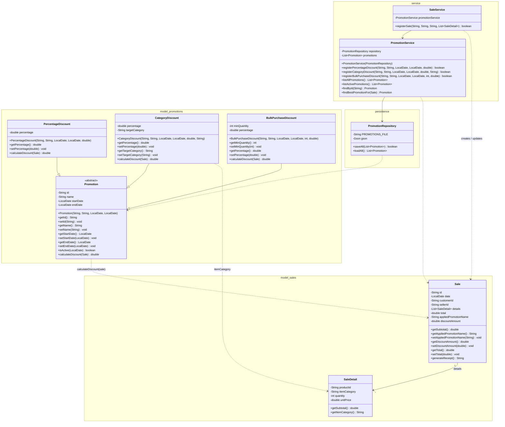

# Promotion Module - Class Diagram

```mermaid
classDiagram
    namespace model_promotions {
        class Promotion {
            <<abstract>>
            -String id
            -String name
            -LocalDate startDate
            -LocalDate endDate
            +Promotion(String, String, LocalDate, LocalDate)
            +getId() String
            +setId(String) void
            +getName() String
            +setName(String) void
            +getStartDate() LocalDate
            +setStartDate(LocalDate) void
            +getEndDate() LocalDate
            +setEndDate(LocalDate) void
            +isActive(LocalDate) boolean
            +calculateDiscount(Sale) double*
        }
        class PercentageDiscount {
            -double percentage
            +PercentageDiscount(String, String, LocalDate, LocalDate, double)
            +getPercentage() double
            +setPercentage(double) void
            +calculateDiscount(Sale) double
        }
        class CategoryDiscount {
            -double percentage
            -String targetCategory
            +CategoryDiscount(String, String, LocalDate, LocalDate, double, String)
            +getPercentage() double
            +setPercentage(double) void
            +getTargetCategory() String
            +setTargetCategory(String) void
            +calculateDiscount(Sale) double
        }
        class BulkPurchaseDiscount {
            -int minQuantity
            -double percentage
            +BulkPurchaseDiscount(String, String, LocalDate, LocalDate, int, double)
            +getMinQuantity() int
            +setMinQuantity(int) void
            +getPercentage() double
            +setPercentage(double) void
            +calculateDiscount(Sale) double
        }
    }

    namespace model_sales {
        class Sale {
            -String id
            -LocalDate date
            -String customerId
            -String sellerId
            -List~SaleDetail~ details
            -double total
            -String appliedPromotionName
            -double discountAmount
            +getSubtotal() double
            +getAppliedPromotionName() String
            +setAppliedPromotionName(String) void
            +getDiscountAmount() double
            +setDiscountAmount(double) void
            +getTotal() double
            +setTotal(double) void
            +generateReceipt() String
        }
        class SaleDetail {
            -String productId
            -String itemCategory
            -int quantity
            -double unitPrice
            +getSubtotal() double
            +getItemCategory() String
        }
    }

    namespace persistence {
        class PromotionRepository {
            -String PROMOTIONS_FILE
            -Gson gson
            +saveAll(List~Promotion~) boolean
            +loadAll() List~Promotion~
        }
    }

    namespace service {
        class PromotionService {
            -PromotionRepository repository
            -List~Promotion~ promotions
            +PromotionService(PromotionRepository)
            +registerPercentageDiscount(String, String, LocalDate, LocalDate, double) boolean
            +registerCategoryDiscount(String, String, LocalDate, LocalDate, double, String) boolean
            +registerBulkPurchaseDiscount(String, String, LocalDate, LocalDate, int, double) boolean
            +listAllPromotions() List~Promotion~
            +listActivePromotions() List~Promotion~
            +findById(String) Promotion
            +findBestPromotionFor(Sale) Promotion
        }
        class SaleService {
            -PromotionService promotionService
            +registerSale(String, String, String, List~SaleDetail~) boolean
        }
    }

    PercentageDiscount --|> Promotion
    CategoryDiscount --|> Promotion
    BulkPurchaseDiscount --|> Promotion
    Sale "1" --> "*" SaleDetail : details
    Promotion ..> Sale : calculateDiscount(sale)
    CategoryDiscount ..> SaleDetail : itemCategory
    PromotionRepository ..> Promotion
    PromotionService --> PromotionRepository
    PromotionService ..> Sale
    SaleService --> PromotionService
    SaleService ..> Sale : creates / updates
```