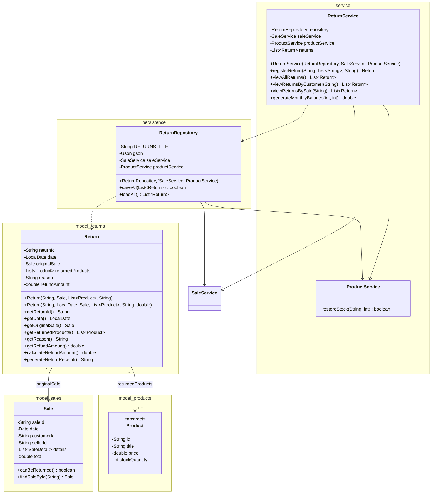

# Return Module - Class Diagram

```mermaid
classDiagram
    namespace model_returns {
        class Return {
            -String returnId
            -LocalDate date
            -Sale originalSale
            -List~Product~ returnedProducts
            -String reason
            -double refundAmount
            +Return(String, Sale, List~Product~, String)
            +Return(String, LocalDate, Sale, List~Product~, String, double)
            +getReturnId() String
            +getDate() LocalDate
            +getOriginalSale() Sale
            +getReturnedProducts() List~Product~
            +getReason() String
            +getRefundAmount() double
            +calculateRefundAmount() double
            +generateReturnReceipt() String
        }
    }

    namespace model_sales {
        class Sale {
            -String saleId
            -Date date
            -String customerId
            -String sellerId
            -List~SaleDetail~ details
            -double total
            +canBeReturned() boolean
            +findSaleById(String) Sale
        }
    }

    namespace model_products {
        class Product {
            <<abstract>>
            -String id
            -String title
            -double price
            -int stockQuantity
        }
    }

    namespace persistence {
        class ReturnRepository {
            -String RETURNS_FILE
            -Gson gson
            -SaleService saleService
            -ProductService productService
            +ReturnRepository(SaleService, ProductService)
            +saveAll(List~Return~) boolean
            +loadAll() List~Return~
        }
    }

    namespace service {
        class ReturnService {
            -ReturnRepository repository
            -SaleService saleService
            -ProductService productService
            -List~Return~ returns
            +ReturnService(ReturnRepository, SaleService, ProductService)
            +registerReturn(String, List~String~, String) Return
            +viewAllReturns() List~Return~
            +viewReturnsByCustomer(String) List~Return~
            +viewReturnsBySale(String) List~Return~
            +generateMonthlyBalance(int, int) double
        }
        class ProductService {
            +restoreStock(String, int) boolean
        }
    }

    Return "*" --> "1" Sale : originalSale
    Return "*" --> "1..*" Product : returnedProducts
    ReturnRepository ..> Return
    ReturnRepository --> SaleService
    ReturnRepository --> ProductService
    ReturnService --> ReturnRepository
    ReturnService --> SaleService
    ReturnService --> ProductService
```