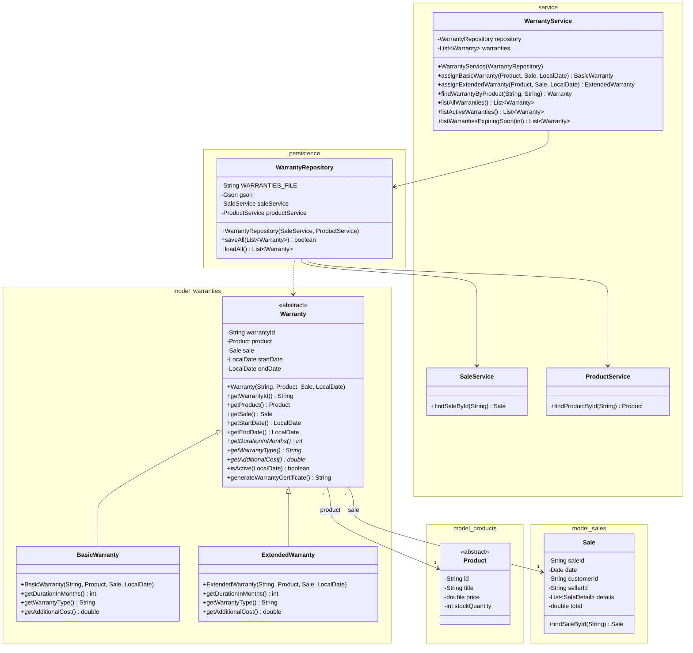

# Warranty Module - Class Diagram

```mermaid
classDiagram
    namespace model_warranties {
        class Warranty {
            <<abstract>>
            -String warrantyId
            -Product product
            -Sale sale
            -LocalDate startDate
            -LocalDate endDate
            +Warranty(String, Product, Sale, LocalDate)
            +getWarrantyId() String
            +getProduct() Product
            +getSale() Sale
            +getStartDate() LocalDate
            +getEndDate() LocalDate
            +getDurationInMonths()* int
            +getWarrantyType()* String
            +getAdditionalCost()* double
            +isActive(LocalDate) boolean
            +generateWarrantyCertificate() String
        }
        class BasicWarranty {
            +BasicWarranty(String, Product, Sale, LocalDate)
            +getDurationInMonths() int
            +getWarrantyType() String
            +getAdditionalCost() double
        }
        class ExtendedWarranty {
            +ExtendedWarranty(String, Product, Sale, LocalDate)
            +getDurationInMonths() int
            +getWarrantyType() String
            +getAdditionalCost() double
        }
    }

    namespace model_products {
        class Product {
            <<abstract>>
            -String id
            -String title
            -double price
            -int stockQuantity
        }
    }

    namespace model_sales {
        class Sale {
            -String saleId
            -Date date
            -String customerId
            -String sellerId
            -List~SaleDetail~ details
            -double total
            +findSaleById(String) Sale
        }
    }

    namespace persistence {
        class WarrantyRepository {
            -String WARRANTIES_FILE
            -Gson gson
            -SaleService saleService
            -ProductService productService
            +WarrantyRepository(SaleService, ProductService)
            +saveAll(List~Warranty~) boolean
            +loadAll() List~Warranty~
        }
    }

    namespace service {
        class WarrantyService {
            -WarrantyRepository repository
            -List~Warranty~ warranties
            +WarrantyService(WarrantyRepository)
            +assignBasicWarranty(Product, Sale, LocalDate) BasicWarranty
            +assignExtendedWarranty(Product, Sale, LocalDate) ExtendedWarranty
            +findWarrantyByProduct(String, String) Warranty
            +listAllWarranties() List~Warranty~
            +listActiveWarranties() List~Warranty~
            +listWarrantiesExpiringSoon(int) List~Warranty~
        }
        class SaleService {
            +findSaleById(String) Sale
        }
        class ProductService {
            +findProductById(String) Product
        }
    }

    Warranty <|-- BasicWarranty
    Warranty <|-- ExtendedWarranty
    Warranty "*" --> "1" Product : product
    Warranty "*" --> "1" Sale : sale
    WarrantyRepository ..> Warranty
    WarrantyRepository --> SaleService
    WarrantyRepository --> ProductService
    WarrantyService --> WarrantyRepository
```