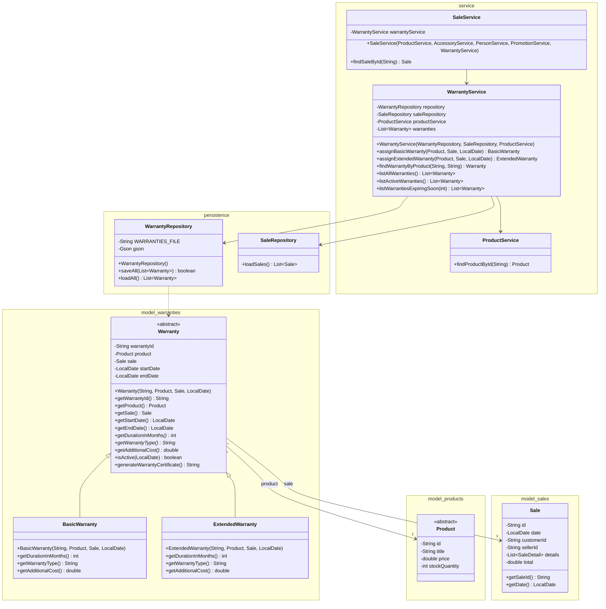

# Warranty Module - Class Diagram

Este diagrama refleja **exactamente lo que existe hoy**: el modelo, la persistencia y el servicio de garantías están completos, pero no hay ninguna flecha hacia `ConsoleUI` ni una versión modificada de `SaleService.registerSale` — porque esa integración todavía no se ha hecho.